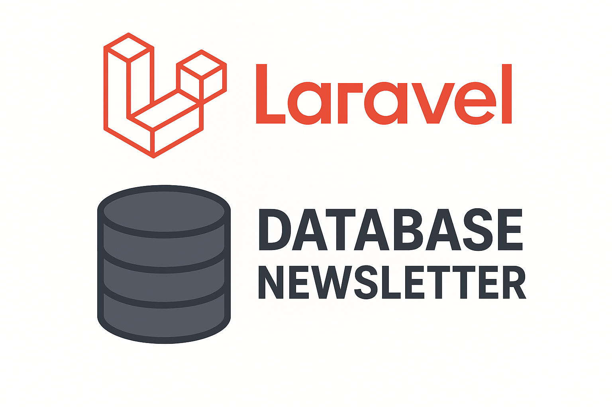

# Laravel Database Newsletter




[](https://packagist.org/packages/nanorocks/laravel-database-newsletter)

**Laravel Database Newsletter** is a simple and elegant package for managing newsletter subscribers directly in your database.  
Instead of relying on third-party services, it allows you to store, check, and manage subscribers locally inside your Laravel application.  

---

## ✨ Features

- 📦 Installable via Composer
- 🗄️ Store subscribers in your own database (MySQL, PostgreSQL, SQLite…)
- 🔐 Supports additional attributes (name, preferences, etc.)
- 📋 Easy subscription management (`subscribe`, `unsubscribe`, `isSubscribed`)
- 🔧 Configuration via `.env` and `config/newsletter.php`
- 🧪 Includes tests for stability and reliability

---

## 🚀 Installation

Require the package via Composer:

```bash
composer require nanorocks/laravel-database-newsletter
```

### Publish migrations and configuration:

```bash
php artisan vendor:publish --tag="newsletter-migrations"
php artisan vendor:publish --tag="newsletter-config"
php artisan migrate
```

## ⚙️ Configuration
Set the driver in your .env file:
```bash
NEWSLETTER_DRIVER=database
```
The configuration file config/newsletter.php can be customized to your needs.

## 📚 Usage

Use the `Newsletter` Facade to manage subscribers:

```php
use Nanorocks\DatabaseNewsletter\Facades\Newsletter;

Route::get('/test-newsletter', function () {
    $email = 'john@example.com';

    // Subscribe a user
    Newsletter::subscribe($email, ['name' => 'John']);

    // Update a subscriber (alias of subscribe)
    Newsletter::subscribeOrUpdate($email, ['name' => 'John Doe']);

    // Check if a user is subscribed
    $isSubscribed = Newsletter::isSubscribed($email);

    // Get subscriber details
    $member = Newsletter::getMember($email);

    // Get all members
    $allMembers = Newsletter::getAllMembers();

    // Unsubscribe a user
    Newsletter::unsubscribe($email);

    // Delete a subscriber
    Newsletter::delete($email);

    return [
        'is_subscribed' => $isSubscribed,
        'member' => $member,
        'all_members' => $allMembers,
        'is_subscribed_after_unsubscribe' => Newsletter::isSubscribed($email),
    ];
});

```
## 🛠 Supported Versions

- PHP: ^8.3

- Laravel: 10.x, 11.x, 12.x

## 📖 Roadmap

- ✅ Database driver
- ⏳ Artisan commands for subscriber management
- ⏳ Laravel Notifications integration
- ⏳ Multi-list support

## 🤝 Contributing
Contributions are welcome! Feel free to submit a pull request or open an issue if you have ideas or find a bug.

## 📜 License
This package is released under the MIT License.